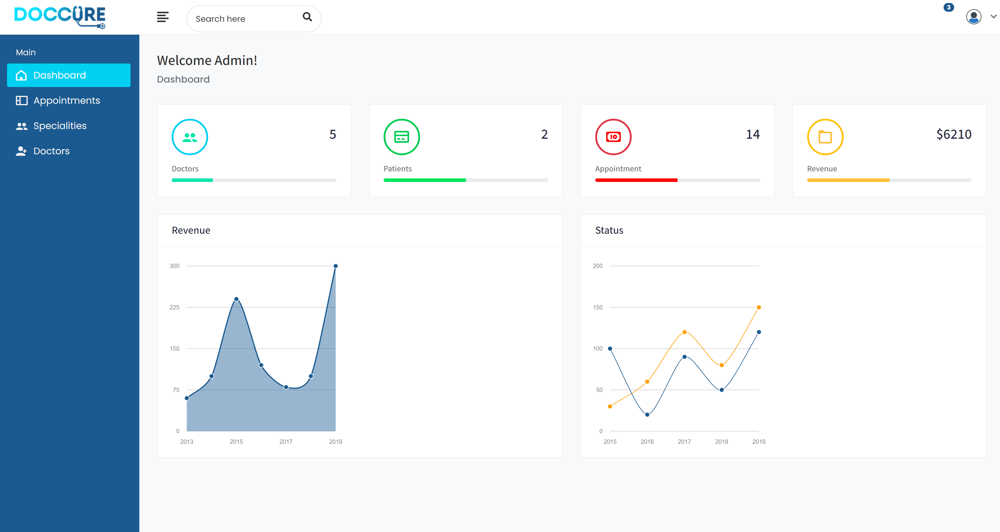
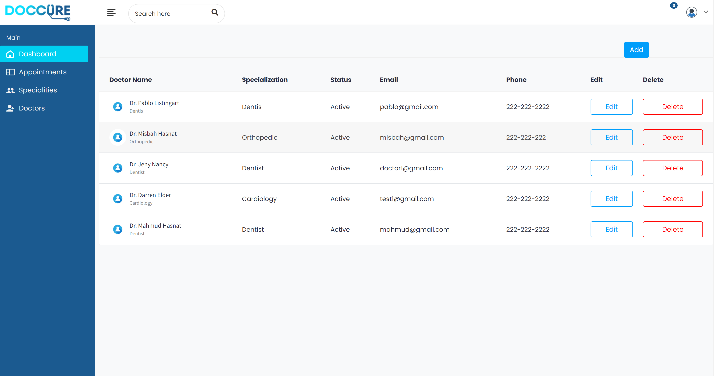
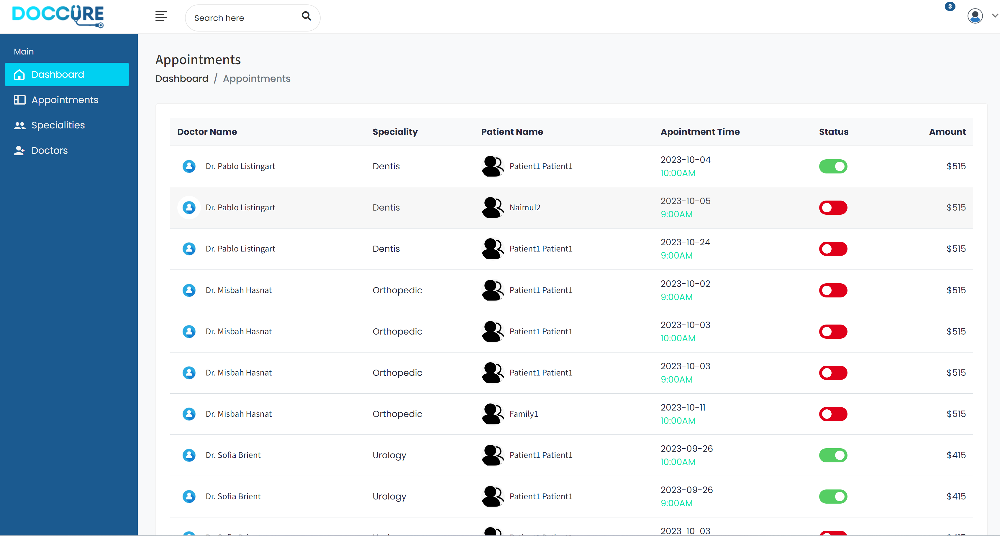
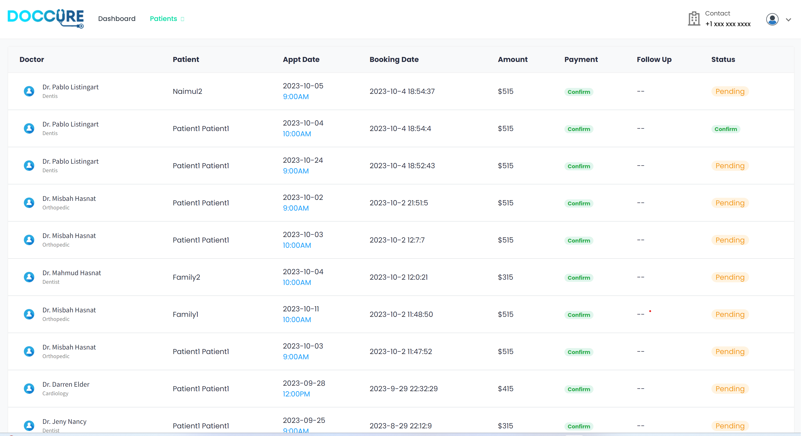
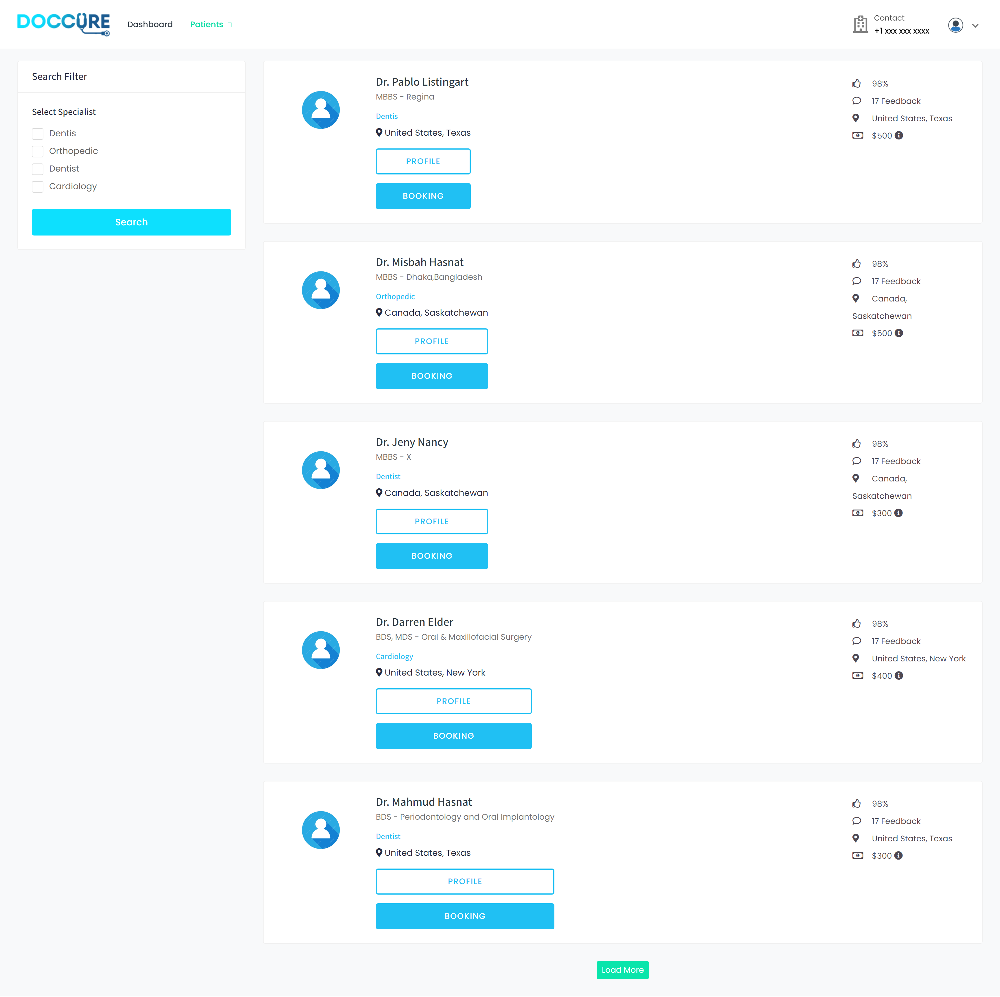
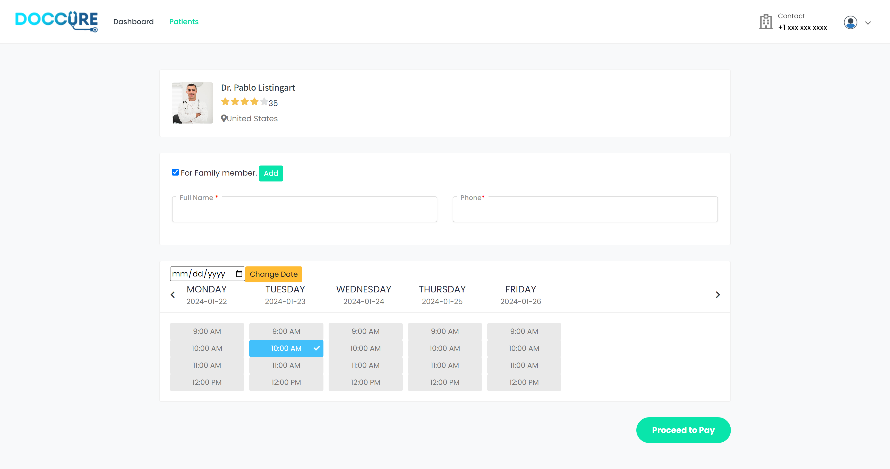
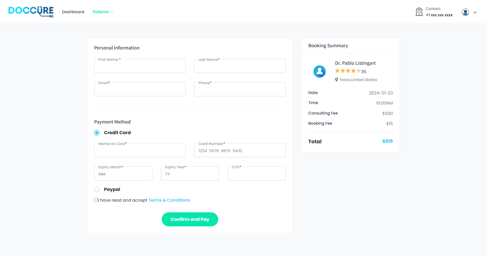

# Project -1
---------------------------------
# Online Doctor Appointment

## Project Overview
This project helps a certain medical establishment such as a clinic or a hospital clients/patients to request an appointment with a doctor online. This project can also help doctors to manage the schedules of their appointments with their patients. This doctor's appointment system will organize the schedules of each patient's appointment, which will be submitted as a request to the doctor they have selected. The system has 3 sides which are the administrator, the doctor, and the patient. The system admin will populate the list of the doctors with their specialties and along with the doctor's details and system credentials. The patients will browse the doctor's appointment system website to find a doctor that has the specialty of their needs. The patient can check the doctor's weekly schedule to help them to choose the day and time which they can comply for the appointment and they will submit their request for an appointment. After that, the doctors can view all their appointments and the appointment request of the patients for their availability.

## Project Fetaures
# Admin’s Side
- Admin can add doctors, edit doctors, delete doctors;
- Schedule new doctors sessions, remove sessions;
- View patient details;
- View booking of patients;
# Doctor's Side
- View their Appointment;
- view their scheduled sessions;
- view details of patients;
- delete account;
- edit account settings;
# Patient's Side
- create accounts themselves;
- view their old booking;
- delete account;
- edit account settings;
- 
## Technology
1.	Front End Development 
-	HTML,
-	CSS,
-	VueJS
-	Bootstrap
2.	Backend development:
-	Firebase

-	## Screen Mocks 

**Home Page**

   

**Admin Landing Page**

 
Doctor Info Page

 
Appointment List

   

**Patient Page**

 
Search Page

 
Booking Page

 
Payment Page

